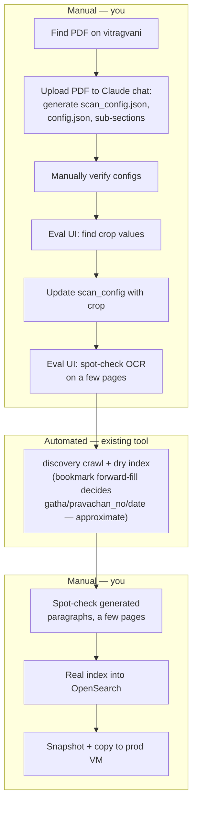
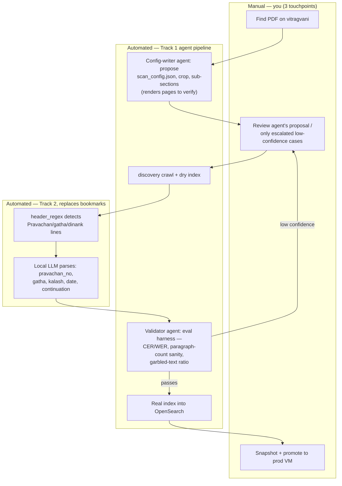

# Cataloguesearch AI Initiative — Product Plan

## 0. Two tracks — don't conflate them

**Track 1 — Throughput**: get the backlog (200+ new Granths, 20+ new Pravachan series) processed with far less manual effort than today's 1–2 hrs/document.

**Track 2 — Accuracy**: improve what's *already indexed* — ~6,000 Pravachans + 75 Granths — specifically the precision of `chunk_labels` (gatha/pravachan_number/date), which today depends on an approximate mechanism (PDF-bookmark forward-fill).

These are independent products. Different data (new PDFs vs. already-indexed content), different risk profiles, no shared critical path — you can run either first, or both in parallel. Track 2 is the smaller, better-bounded bet: no new PDFs, no OCR-engine decisions, no dependency on the 26,309-page distillation dataset. Track 1 is the bigger, multi-month bet.

## 1. Problem statement

**Track 1**: every new PDF today gets a hand-written `scan_config.json`, inspected visually, tuned by eye — sourced from vitragvani, config-generated via a Claude chat, crop-tuned and spot-checked in the Eval UI, dry-indexed, spot-checked again, indexed, then snapshotted to the prod VM. ~1–2 hrs/document. ~200+ Granths and ~20+ Pravachan series remain in the backlog.

**Track 2**: `discovery.py`'s `_apply_forward_fill` maps every page to `{pravachan_no, date, gatha, kalash, shlok, doha, kavya, sutra}` by trusting a PDF bookmark's native page number as "authoritative," then propagating that value to every subsequent page until the next bookmark. Two independent, compounding sources of error:
- The PDF's own bookmark page-anchor can simply be wrong — proven directly this session: Panchadhyayi's "Uttarardh" bookmark pointed at page 247 (a blank cover), while the real content started at page 264, 17 pages off.
- Even a correct anchor gets propagated uncritically across every page until the next bookmark, so one missed or mistimed bookmark misattributes a whole run of paragraphs.

Only 1 of ~57 Pravachan-series configs sets `ignore_bookmarks` — this approximation is the default for essentially your entire existing Pravachan corpus, and it's directly user-facing (search filters, citations, displayed chunk metadata).

No eval instrumentation exists anywhere in the pipeline today (confirmed by direct inspection) — every quality judgment, on both tracks, is currently you looking at it.

## 2. Workflow: before vs. after

**Before** — your actual current workflow, ~1–2 hrs/document, 7 of 10 steps manual:

**After** — Track 1 (agent pipeline) + Track 2 (text-detected headers) applied, manual shrinks to 3 touchpoints:

| | Before | After |
|---|---|---|
| Manual touchpoints | 7 of 10 steps | 3 (source, review-on-escalation, promote) |
| Time per document | ~1–2 hrs, every document | Mostly unattended; your time only spent on escalated cases |
| Gatha/pravachan_no/date | PDF-bookmark forward-fill (approximate, page-level) | Text-detected header + local LLM parse, line-anchored (Track 2) |
| OCR engine/cost | Tesseract/Pravachan, Gemini `llm`/Granth | Unchanged baseline (see cost-safety rule in Appendix); Track 1 steps 1–4 may reduce it further |
| What decides "good enough" | You, looking at it | Step 5's eval harness (CER/WER, paragraph-count sanity, garbled-text ratio) |

## 3. Track 2, fully specified: replace bookmarks with text-detected headers

Confirmed by the pages you shared: every Pravachan opens with a printed header line — "प्रवचन नं. ६२ गाथा-१५६ से १६० ... दिनांक १४.०७.१९६७", or a continuation marker "प्रवचन नं. ११५ का शेष" with no new gatha/date (inherit from the previous header). This is ground truth sitting directly in the text being OCR'd — no PDF bookmark needed at all.

**Two pieces of this already exist in the codebase, disconnected from each other:**

- **Detection**: `Pravachans/hindi/scan_config.json`'s `header_regex` already matches these exact lines (`"^.{0,5}प्रवचन\\s?नं.{0,50}[०-९]{1,6}.{0,20}$"`, etc.). In [`advanced.py:125-128`](backend/crawler/paragraph_generator/advanced.py:125), a match just gets tagged `IS_HEADER_REGEX` and excluded from prose — **the matched text is discarded**, never parsed. This detection already runs on every line of every page, at zero marginal cost.
- **Structured parsing**: [`bookmark_extractor/base.py`](backend/crawler/bookmark_extractor/base.py:19) already has a working LLM prompt — "extract Pravachan Number, Date, Gatha, Kalash, Shlok" — with both a Gemini and an **Ollama (local)** implementation already coded (`factory.py`). It's just pointed at PDF bookmark titles, not at these in-page header lines.

**The project**: not "build a local model from scratch" — redirect what already exists.
1. When a line matches `header_regex` (cheap, existing, runs on every line — this is your "basic string matching"), capture the line's text instead of discarding it.
2. Send only the *captured* lines (a tiny fraction of total lines) to the existing Ollama-based extractor, repointed at this input instead of bookmark titles. It needs one new case: a continuation line ("... का शेष") with no gatha/date/kalash means "inherit the previous values," not "clear them" — same forward-fill *concept* as today, but anchored to a real detected event in the text, not a trusted-blind PDF page number.
3. Replace `discovery.py`'s bookmark-derived `page_to_pravachan_data` with this text-derived, line-anchored map.

**Why this is better than the bookmark approach, concretely**: no dependency on PDF bookmark page-number accuracy at all (sidesteps the Panchadhyayi-style failure entirely), precision improves from whole-page forward-fill to per-paragraph, and validation is direct — the "ground truth" is a line you can read in the same OCR output you already produce, not a separate PDF structure requiring a fresh page-render to check (unlike `sub_sections`, which genuinely does need vision verification).

## 4. Skills matrix — what you actually learn from what

| Skill (from your original brief) | Where it's exercised | What "done" looks like |
|---|---|---|
| Agent loop (plan→act→observe→revise) | Track 1's config-writer (Stage E) | Produces `scan_config.json` unattended, using dry-run + page-render as its "observe" step — same loop I ran by hand for Panchadhyayi |
| Multi-agent orchestration, handoffs | Track 1, Stage H | Validator can hand work back to the config-writer, not just forward |
| Tool use / "code mode" | Both tracks' agents calling `discovery` CLI, rendering pages, reading OpenSearch | Agent writes/calls real tools, not just chat text |
| Long-running/background agents | Track 1 running unattended across 200+ PDFs | Survives a restart mid-batch without redoing finished work |
| Confidence estimation & escalation | Track 1 Stage G; Track 2's header-detection confidence | Decides what's worth interrupting you for, and what isn't |
| Open vs. frontier tradeoffs, quantization | Track 1 steps 1–4 (OCR/classification distillation); Track 2's local extractor | A real decision, backed by your own eval numbers, not vibes |
| VLM for document understanding | Already in production (Gemini `llm` engine) | Distillation work is "replicate what Gemini already does, locally" |
| Real eval harnesses vs. vibes | Track 1 step 5; Track 2's ground-truth spot-checks | A number, not a feeling, decides keep-vs-discard |
| LoRA/QLoRA | Track 1 step 1, or a small model tuned for Track 2's header-parsing edge cases | A fine-tuned checkpoint you can point to |
| Distillation (teacher/student) | Track 1 steps 1–2, using the 26,309 already-Gemini-labeled pages | No new teacher calls needed — data already exists |
| Active learning | Escalated low-confidence cases feeding back into training data | The loop actually closes, not just one-shot training |
| Silent quality degradation (named goal in your brief) | **Track 2's bookmark problem *is* the textbook example** — wrong labels, no crash, no error | You can point to a real bug you found and fixed, not a hypothetical |
| Observability (why, not just what) | Both tracks' agent reasoning traces | You can answer "why did it pick this gatha number" after the fact |
| Cost modeling, routing economics | The Stage-C cost bug you caught and I fixed | Already exercised once, for real, this session |

## 5. Scale, honestly

**Track 1 backlog**: 200+ Granths, 20+ Pravachan series (series can span many PDFs each — I don't have an exact multiplier per series; worth pinning down before estimating total hours). At today's 1–2 hrs/doc, Granths alone are a 200–400+ hour manual floor if untouched.

**Track 2 corpus at risk**: ~6,000 already-indexed Pravachans, of which only ~1 series opts out of bookmark-forward-fill — meaning the approximation is the default across nearly the whole existing corpus, not an edge case.

## 6. Recommendation

Track 2 first: smaller, cheaper, touches content you already have, doesn't need Track 1's distillation work to exist first, and is a clean, well-bounded local-model exercise end to end. Track 1 is the bigger bet — worth doing, but only once you've deliberately chosen "throughput on new content" as the next multi-month commitment over "accuracy on what's already live." Not telling you to start either — this is a real fork, worth deciding on purpose.

## Appendix: Track 1 stage table (cost-corrected)

**Cost-safety rule, non-negotiable**: "frontier default" never means defaulting every stage to Gemini. Stages A, B, E, G, H cost about one call *per document* — cheap regardless of book length. Stage C (actual OCR) costs per *page*, and Pravachans (6,000+) outnumber Granths (75) 80:1 — defaulting Stage C to Gemini for everything would multiply your dominant cost driver. Stage C's baseline is always **today's existing per-type assignment**: Tesseract for Pravachans, Gemini `llm` only for Granths — unchanged, until a local upgrade actually beats it on the eval harness.

| Stage | What it does | Frontier default (works today) | Local upgrade | If discarded |
|---|---|---|---|---|
| 0. Source PDFs from vitragvani | Find + download | Manual | — (not scoped) | Stays manual, low pain |
| A. Classify → series/Anuyog/doc-type | Sort incoming PDFs | Gemini vision call, or folder placement | — (not scoped) | No loss, cheap either way |
| B. Extract metadata (author, Name, dates) | Per-document | Gemini/Claude on title pages | — (open gap) | Stays a small, bounded cost |
| C. OCR + per-block classification | Core content pipeline | **Unchanged from today**: Tesseract/Pravachan, Gemini `llm`/Granth only | Steps 1–4: distill the 26,309 labeled pages, audit noise, resolve Gujarati gap, local infra | No regression, no new cost, just no reduction yet |
| D. Re-run improved OCR on the 101,712 unclassified pages | Extends C backward | N/A | Step 6, downstream of C | Those pages stay as-is |
| E. Generate `scan_config.json` + sub-sections | Crop/regex/sub-sections | **Already working today** — a Claude chat, run by hand | Cheaper if scripted, cheaper still with C's classifier feeding it signal | Keeps working exactly as today; doesn't need C |
| — Crop tuning + spot-check | Eval UI, manual | Manual | Foldable into E's loop | Stays manual, no regression |
| F. OCR execution + indexing | Runs the pipeline | `discovery` — already built | — | N/A |
| G. Validate output, escalate | Where "less manual effort" comes from | You, spot-checking | Step 5 (CER/WER, paragraph-count sanity, garbled-text detection) | Runs automatically but you still review everything by hand — near-real prerequisite |
| H. Orchestration (validator ↔ config-writer) | The actual multi-agent part | Works once E and G exist in any form | — | Depends on E/G existing, not their local versions |
| I. Snapshot + promote to prod VM | Ship it live | Manual | — (not scoped) | Stays manual, a deploy step not a quality one |

Step 8 (local NL→filter for Search API) doesn't touch this pipeline at all — fully independent, keep or drop on its own.

**Suggested order (not strict)**: a rough eval harness (step 5) first, since it's what judges every other bet → stand up A/B/E/F/G/H on cheap per-document calls (working pipeline fast, no OCR cost change) → attempt C (steps 1–4) gated by step 5 → D only if C clears the bar → step 8 whenever, independently.
